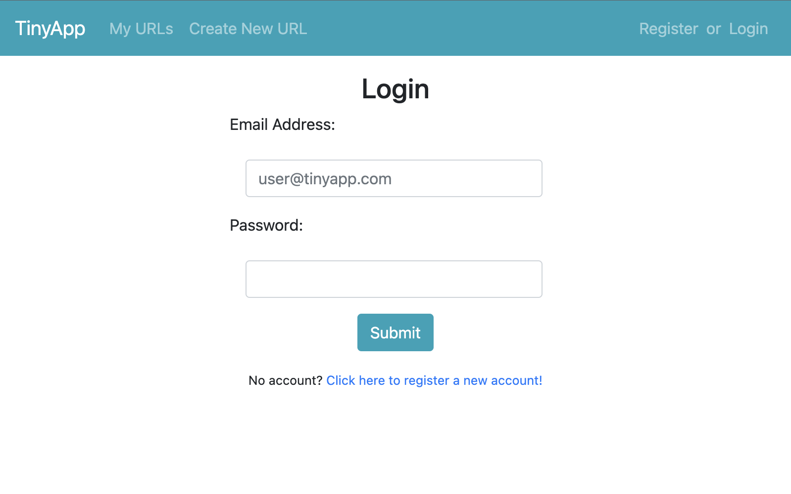
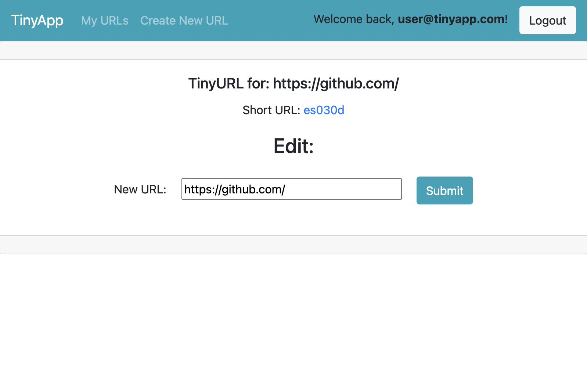

# TinyApp Project

Are you sick of sending your friends needlessly long URLs?

Wouldn't you rather have a link that doesn't take up your entire message box?

If this is you, TinyApp is here to meet your needs!

TinyApp is a full stack web application built with Node and Express that allows users to shorten long URLs (just like its distant relative, bit.ly).

## Final Product

## Features

- Stick any URL into TinyApp and you'll get a unique Tiny URL that goes to the same place!

- You'll be able to see all your created links on your 'My URLs' page.

- Anyone can use your Tiny URL link, but only you can edit or delete it!

## Dependencies

- Node.js
- Express
- EJS
- bcrypt
- body-parser
- cookie-session

## Getting Started

- Install all dependencies (using the `npm install` command).
- Run the development web server using the `node express_server.js` command.