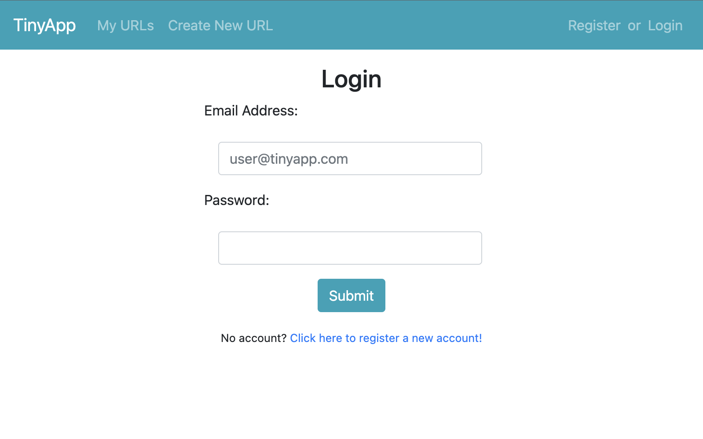
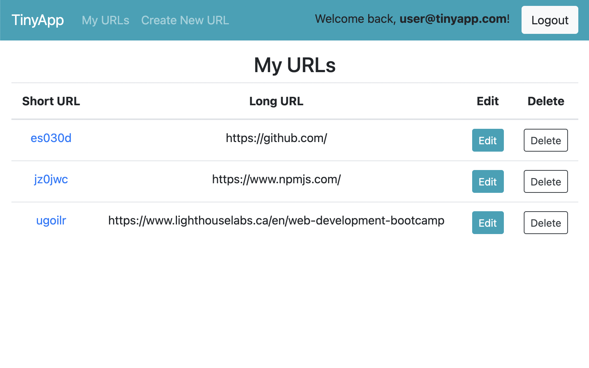
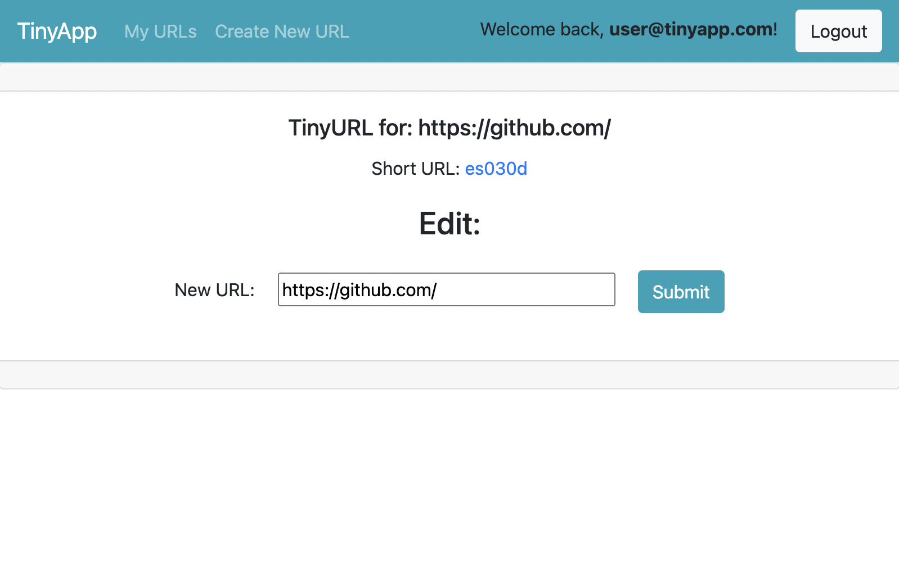

# TinyApp Project

Are you sick of sending your friends needlessly long URLs?
Wouldn't you rather have a link that doesn't take up your entire message box?

If so, TinyApp is here to meet your needs!

TinyApp is a full stack web application built with Node and Express that allows users to shorten long URLs (just like its long lost cousin, bit.ly).

## Final Product

## Features

Stick a URL into TinyApp and you'll get a unique Tiny URL!

You'll be able to see all your created links on our 'My URLs' page.

Anyone can use your Tiny URL link, but only you can edit or delete it!

## Dependencies

- Node.js
- Express
- EJS
- bcrypt
- body-parser
- cookie-session

## Getting Started

- Install all dependencies (using the `npm install` command).
- Run the development web server using the `node express_server.js` command.